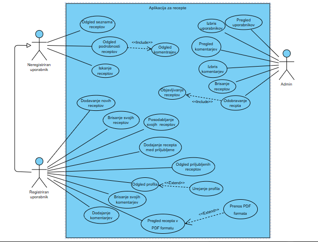

# RIS Recepti Projekt

Projekt RIS Recipe Project je spletna aplikacija za upravljanje in prikaz receptov. 
Sestavljen je iz Spring Boot zalednega dela (backend) in React uporabniškega vmesnika (frontend).

**Vizija:**
>Vaša digitalna kuharska knjiga za vaše najljubše recepte – vse na enem mestu,
vedno pri roki za ustvarjanje, urejanje in uporabo.

## Diagram poteka uporabe (DPU)




## Člani ekipe
- Iva Janeva
- Nađa Tomović
- Veljko Stojanović
## Struktura projekta
```
── ris-recipe-project/
   ├── vaja1Ris/                 # Backend – Spring Boot projekt
   │   ├── src/main/java/...     # Java izvorna koda (controllerji, modeli, DAO)
   │   ├── src/main/resources/   # Konfiguracijske datoteke in HTML/JS/CSS
   │   ├── pom.xml               # Maven konfiguracija
   │
   ├── frontend/                 # Frontend – React aplikacija
   │   ├── src/                  # Komponente in glavni React elementi
   │   ├── public/               # HTML in favicon
   │   ├── package.json          # Odvisnosti in skripte za zagon
   │
   └── README.md
   ```


## Razvojno okolje in tehnologije
- **Frontend:** React.js 18.2.0, uporabniški vmesnik
- **Backend:** Java 17+, Spring Boot 3.5.6 REST API za delo z recepti
- **Baza podatkov:** MySQL 8.0.32, data.sql - začetni podatki ob zagonu
- **Docker:** Docker 24.0.5 in Docker Compose 2.21.0 za enostavno namestitev in zagon aplikacije
- **Maven:** Maven 3.9.1 za upravljanje backend odvisnosti
- **Node.js & npm:** Node.js v18.17.1, npm 9.6.7 za upravljanje frontend odvisnosti
- **Git/GitHub:** za nadzor verzij 

## Standardi kodiranja
- **Java:** Backend sledi standardom Spring Boot REST konvencij.
- **React/JS:** Frontend uporablja komponente v Reactu z razdelitvijo po funkcionalnostih.
- **SQL:** standardne SQL izjave za ustvarjanje in vstavljanje podatkov
- Imena spremenljivk in metod so v camelCase, razredi v PascalCase.
  Koda je urejena in berljiva, vsak razred ali komponenta ima jasno odgovornost.
# Besednjak

## SPLOŠNI IZRAZI

| Slovenski izraz         | Angleški izraz       | Opis                                                                 |
|------------------------|-------------------|----------------------------------------------------------------------|
| Aplikacija za recepte   | Recipe Application | Sistem za upravljanje kulinaričnih receptov                          |
| Uporabnik               | User               | Oseba, ki uporablja aplikacijo                                       |
| Neregistriran uporabnik | Unregistered User  | Uporabnik brez računa, ki lahko samo pregleduje in filtrira recepte  |
| Registriran uporabnik   | Registered User    | Uporabnik z računom, ki lahko dodaja, ureja ali briše svoje recepte, ogleda profil in priljubljene recepte |
| Administrator           | Administrator      | Uporabnik z nadzornimi pravicami (admin)                             |
| Recept                  | Recipe             | Navodilo za pripravo jedi s sestavinami, časom priprave in navodili |
| Kategorija              | Category           | Skupina receptov: Sweets, Salads, Meat, Pasta, Soup (v bazi se shranjuje angleški izraz) |

## CRUD OPERACIJ

| Slovenski izraz      | Angleški izraz | Opis                             |
|---------------------|----------------|----------------------------------|
| Dodajanje            | Create         | Ustvarjanje novega zapisa       |
| Branje/Prikaz        | Read           | Prikazovanje obstoječih podatkov |
| Posodabljanje        | Update         | Spreminjanje obstoječih podatkov |
| Brisanje             | Delete         | Trajno odstranjevanje podatkov   |

## PODATKOVNI MODEL - RECIPE TABELA

| Polje        | Tip                | Angleški izraz   | Opis / Notes                                                                 |
|--------------|------------------|----------------|----------------------------------------------------------------------------|
| ID           | INT, AUTO_INCREMENT | Id             | Edinstvena identifikacijska številka (Primary Key)                          |
| Ime/Naslov   | VARCHAR           | Name           | Naziv recepta                                                              |
| Opis         | VARCHAR           | Description    | Kratek opis recepta                                                        |
| Trajanje     | INT               | Duration       | Čas priprave recepta v **minutah**                                        |
| URL slike    | VARCHAR           | Image URL      | Povezava do slike recepta (valid URL)                                      |
| Sestavine    | VARCHAR           | Ingredients    | Seznam potrebnih sestavin za pripravo, ločen z vejicami                    |
| Navodila     | VARCHAR           | Instructions   | Podroben opis priprave jedi                                               |
| Kategorija   | VARCHAR           | Category       | Vrsta jedi. Možne vrednosti: **Sweets (Sladice), Salads (Solate), Meat (Meso), Pasta (Testenine), Soup (Juha)** |

## FUNKCIONALNOSTI - PREGLED

| Slovenski izraz                  | Angleški izraz          | Opis                                          |
|---------------------------------|-----------------------|-----------------------------------------------|
| Ogled seznama receptov           | View Recipe List      | Prikaz vseh receptov v obliki seznama         |
| Ogled podrobnosti recepta        | View Recipe Details   | Podroben prikaz posameznega recepta           |
| Iskanje receptov                 | Search Recipes        | Iskanje receptov po ključnih besedah         |
| Filtriranje po kategoriji        | Filter by Category    | Prikaz receptov določene kategorije          |
| Pregled komentarjev              | View Comments         | Prikaz komentarjev k receptu                 |
| Pregled uporabnikov              | View Users            | Prikaz seznama uporabnikov (admin)          |

## FUNKCIONALNOSTI - UPRAVLJANJE RECEPTOV

| Slovenski izraz                  | Angleški izraz        | Opis                                         |
|---------------------------------|--------------------|---------------------------------------------|
| Dodajanje novih receptov         | Add New Recipe     | Vnos novega recepta v sistem               |
| Posodabljanje svojih receptov    | Update Own Recipes | Urejanje lastnih objavljenih receptov      |
| Brisanje svojih receptov         | Delete Own Recipes | Odstranjevanje lastnih receptov            |
| Brisanje receptov                | Delete Recipes     | Odstranjevanje kateregakoli recepta (admin)|
| Odobravanje receptov             | Approve Recipes    | Potrditev receptov pred objavo (admin)     |
| Objavljivanje receptov           | Publish Recipes    | Objava receptov v sistem                    |
| Dodajanje receptov med priljubljene | Add to Favorites | Označevanje receptov kot priljubljenih     |
| Ogled priljubljenih receptov     | View Favorite Recipes | Prikaz vseh priljubljenih receptov       |

## FUNKCIONALNOSTI - KOMENTARJI

| Slovenski izraz          | Angleški izraz      | Opis                                    |
|--------------------------|------------------|-----------------------------------------|
| Dodajanje komentarjev     | Add Comments      | Objavljanje komentarjev k receptom     |
| Brisanje svojih komentarjev | Delete Own Comments | Odstranjevanje lastnih komentarjev     |
| Izbris komentarjev        | Delete Comments   | Odstranjevanje kateregakoli komentarja (admin) |

## FUNKCIONALNOSTI - UPORABNIŠKI PROFIL

| Slovenski izraz          | Angleški izraz | Opis                            |
|--------------------------|----------------|---------------------------------|
| Ogled profila            | View Profile    | Prikaz uporabniškega profila    |
| Urejanje profila         | Edit Profile    | Spreminjanje podatkov profila   |
| Izbris uporabnikov       | Delete Users    | Odstranjevanje uporabniških računov (admin) |

## TEHNIČNI IZRAZI - BACKEND

| Slovenski izraz       | Angleški izraz | Opis                                        |
|----------------------|----------------|--------------------------------------------|
| Strežnik             | Server/Backend | Zaledni del aplikacije (Spring Boot)       |
| Končna točka          | Endpoint       | API URL za dostop do funkcionalnosti       |
| Baza podatkov         | Database       | MySQL sistem za shranjevanje podatkov      |
| Tabela               | Table           | Struktura v bazi podatkov                  |
| Primarni ključ        | Primary Key    | Edinstveni identifikator zapisa            |

## TEHNIČNI IZRAZI - FRONTEND

| Slovenski izraz       | Angleški izraz | Opis                                        |
|----------------------|----------------|--------------------------------------------|
| Uporabniški vmesnik  | User Interface (UI) | Vizualni del aplikacije (React)      |
| Obrazec              | Form           | Vnosno polje za podatke                    |
| Gumb                 | Button         | Interaktivni element za dejanja            |
| Izbirnik             | Dropdown       | Meni za izbiro možnosti                     |
| Filter               | Filter         | Orodje za zožanje rezultatov               |

## ODNOSI V UML DIAGRAMU

| Slovenski izraz | Angleški izraz | Opis                                                        |
|----------------|----------------|-------------------------------------------------------------|
| Include        | Include        | Obvezna funkcionalnost (vedno se izvede)                   |
| Extend         | Extend         | Dodatna/opcijska funkcionalnost, če uporabnik želi         |
| Akter          | Actor          | Oseba ali sistem, ki uporablja funkcionalnost             |
| Primer uporabe | Use Case       | Funkcionalnost, ki jo sistem ponuja                        |
| Meja sistema   | System Boundary | Okvir, ki označuje obseg sistema                           |

## Navodila za namestitev

### Predpogoji
- Java JDK 17+
- Docker in Docker Compose
- Node.js(v18 ali novejši) in npm
- Maven

### Namestitev backend-a
1. Odprite terminal v `vaja1Ris/` mapi.
2. Zaženite ukaz:
   ```bash
   mvn spring-boot:run
   ```
3. Zaženite aplikacijo preko Dockerja:
   ```bash
   docker-compose up --build
   ```
## Zagon frontend-a

1. Odprite terminal v `frontend/` mapi projekta.

2. Namestite potrebne odvisnosti:
   ```bash
   npm install 
   ```
3. Zaženite aplikacijo v razvojni obliki:
   ```bash
   npm start
   ```
4. Odprite brskalnik in pojdite na: http://localhost:3000

### Dostop do aplikacije:
- **Frontend:** http://localhost:3000
- **Backend API:** http://localhost:8083
- **MySQL baza:** localhost:3309

## Navodila za razvijalce / Git

Če želite prispevati k projektu ali delati lokalno kopijo:

1. Klonirajte repozitorij:
   ```bash
   git clone <https://github.com/ivajaneva/ris-recipe-project>
   ```
2. Pojdite v mapo projekta:
   ```bash   
   cd ris-recipe-project
   ```
3. Dodajte spremembe in naredite commit
   ```bash   
   git add .
   git commit -m "Opis sprememb"
   ```
4. Potisnite spremembe v GitHub:
   ```bash   
   git push origin main
   ```


 

